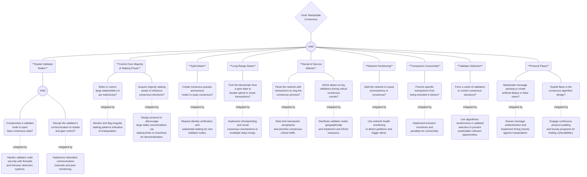

```mermaid
flowchart TD
  A0{Goal: Manipulate\nConsensus}:::objective
    A0---B1(((AND))):::booleanAnd
      B1---C1(**Exploit Validator\nNodes**):::condition
        C1---D1(((AND))):::booleanAnd
          D1---E1(Compromise a validator\nnode to inject\nfalse consensus data?):::condition
            E1-. mitigated by .-F1(Harden validator node\nsecurity with firewalls\nand intrusion detection systems.):::condition
          D1---E2(Disrupt the validator's\ncommunication to isolate\nand gain control?):::condition
            E2-. mitigated by .-F2(Implement redundant communication\nchannels and peer monitoring.):::condition
      B1---C2(**Control Over Majority\nof Staking Power**):::condition
        C2---D2(Bribe or coerce\nlarge stakeholders to\nact maliciously?):::condition
          D2-. mitigated by .-E3(Monitor and flag irregular\nstaking patterns indicative\nof manipulation.):::condition
        C2---D3(Acquire majority staking\npower to influence\nconsensus decisions?):::condition
          D3-. mitigated by .-E4(Design protocol to discourage\nlarge stake concentrations via\nstaking limits or incentives for decentralization.):::condition
      B1---C3(**Sybil Attack**):::condition
        C3---D4(Create numerous pseudo-anonymous\nnodes to sway consensus?):::condition
          D4-. mitigated by .-E5(Require identity verification and\nsubstantial staking for new\nvalidator nodes.):::condition
      B1---C4(**Long-Range Attack**):::condition
        C4---D5(Fork the blockchain from\na past state to\ndouble-spend or erase transactions?):::condition
          D5-. mitigated by .-E6(Implement checkpointing and social\nconsensus mechanisms to invalidate deep reorgs.):::condition
      B1---C5(**Denial of Service\nAttacks**):::condition
        C5---D6(Flood the network with\ntransactions to clog the\nconsensus process?):::condition
          D6-. mitigated by .-E7(Rate limit transaction acceptance\nand prioritize consensus-critical traffic.):::condition
        C5---D7(DDoS attack on key\nvalidators during critical consensus\nrounds?):::condition
          D7-. mitigated by .-E8(Distribute validator nodes geographically\nand implement anti-DDoS measures.):::condition
      B1---C6(**Network Partitioning**):::condition
        C6---D8(Split the network to cause\ninconsistency in consensus?):::condition
          D8-. mitigated by .-E9(Use network health monitoring\nto detect partitions and trigger alerts.):::condition
      B1---C7(**Transaction Censorship**):::condition
        C7---D9(Prevent specific\ntransactions from\nbeing included in blocks?):::condition
          D9-. mitigated by .-E10(Implement inclusion incentives and\npenalties for censorship.):::condition
      B1---C8(**Validator Selection**):::condition
        C8---D10(Form a cartel of validators\nto control consensus decisions?):::condition
          D10-. mitigated by .-E11(Use algorithmic randomness in validator\nselection to prevent predictable collusion opportunities.):::condition
      B1---C9(**Protocol Flaws**):::condition
        C9---D11(Manipulate message passing to create\nartificial delays or false views?):::condition
          D11-. mitigated by .-E12(Ensure message authentication and\nimplement timing checks against manipulation.):::condition
        C9---D12(Exploit flaws in the\nconsensus algorithm design?):::condition
          D12-. mitigated by .-E13(Engage continuous protocol auditing\nand bounty programs for finding vulnerabilities.):::condition
```