```mermaid
flowchart TD
  A0{Goal: Crash the\nvalidator}:::objective
    A0---B1(((OR))):::booleanOr
      B1---C1(**Exploit System\nVulnerabilities**):::condition
        C1---D1(((AND))):::booleanAnd
          D1---E1(Utilize known software\nbugs in the validator's\ncodebase):::condition
          D1---E2(Inject malformed data into\nthe validator to\ntrigger crashes):::condition
          D1---E3(Overwhelm the validator memory\nwith large or complex\ntransactions):::condition
      B1---C2(**Network-Level Attacks**):::condition
        C2---D2(((AND))):::booleanAnd
          D2---E4(Flood the validator with\ntraffic to exhaust\nnetwork resources):::condition
          D2---E5(Perform a Sybil attack with\nmultiple nodes\nto disrupt network consensus):::condition
          D2---E6(Conduct a DDoS attack by\ncoordinating a botnet\nto target validators):::condition
      B1---C3(**Transaction-Level Attacks**):::condition
        C3---D3(((AND))):::booleanAnd
          D3---E7(Send rapid sequences of\ncomplex transactions to\nmax out processing capabilities):::condition
          D3---E8(Craft transactions that\ncause infinite loops or\nunhandled exceptions in transaction processing):::condition
          D3---E9(Exploit smart contracts to\nperform actions that\nvalidators cannot process efficiently):::condition
      B1---C4(**Protocol-Based Attacks**):::condition
        C4---D4(((AND))):::booleanAnd
          D4---E10(Manipulate messaging or\nconsensus protocols to\ncreate conflicts and confusion among nodes):::condition
          D4---E11(Abuse protocol weaknesses\nto create states that\nvalidators cannot reconcile):::condition
          D4---E12(Induce forks through\nconflicting transactions to\nsplit network consensus):::condition
      B1---C5(**Resource Exhaustion**):::condition
        C5---D5(((AND))):::booleanAnd
          D5---E13(Continuously request\nresource-intensive operations\nto deplete computational power):::condition
          D5---E14(Engage smart contracts\nin ways that consume excessive gas,\ndepleting network resources):::condition
      B1---C6(**Malicious Contract Deployment**):::condition
        C6---D6(((AND))):::booleanAnd
          D6---E15(Deploy smart contracts designed\nto perform actions that are detrimental\nto validator performance):::condition
          D6---E16(Initiate contracts that\ninteract in unexpected ways, causing validators to fail):::condition
      B1---C7(**Insider Threats**):::condition
        C7---D7(((AND))):::booleanAnd
          D7---E17(Compromise insider accounts\nto gain direct access to\nvalidator nodes):::condition
          D7---E18(Utilize insider knowledge to\nperform actions that\nwould not be externally visible):::condition
      B1---C8(**Cryptographic Attacks**):::condition
        C8---D8(((AND))):::booleanAnd
          D8---E19(Attempt to break cryptographic\nalgorithms used by validators\nto ensure data integrity):::condition
          D8---E20(Exploit any weaknesses in\ncryptographic implementations\nto cause crash):::condition
```

## Attack Tree Documentation: Denial of Service (DoS) via Validator Crash

### Goal
Crash the network's validators to execute a Denial of Service (DoS) attack.

### Attack Vectors

#### Exploit System Vulnerabilities
- **Software Bugs**: Target known bugs in the validator's codebase for exploitation.
- **Malformed Data Injection**: Send data that is intentionally structured incorrectly to cause crashes.
- **Memory Overwhelm**: Create transactions that are designed to use up excessive memory on the validator.
- **OS and Software Exploits**: Leverage specific vulnerabilities related to the validator's operating system or other software dependencies.

#### Network-Level Attacks
- **Traffic Flooding**: Overload the validator with a high volume of network requests.
- **Sybil Attack**: Disrupt consensus by creating numerous deceptive nodes in the network.
- **DDoS Coordination**: Utilize a network of compromised machines (botnet) to flood validators with requests.

#### Transaction-Level Attacks
- **Complex Transaction Sequences**: Rapidly send complex transactions to overwhelm processing capacities.
- **Malicious Transaction Crafting**: Design transactions that lead to infinite loops or exceptions in processing.
- **Smart Contract Exploits**: Use smart contracts to perform operations that are resource-intensive for validators.

#### Protocol-Based Attacks
- **Messaging Manipulation**: Alter communication protocols to cause node conflicts.
- **Protocol Weakness Abuse**: Exploit protocol flaws that lead to non-reconcilable states.
- **Induced Forking**: Send conflicting transactions to create network forks and split consensus.

#### Resource Exhaustion
- **Intensive Operation Requests**: Repeatedly request operations that drain computational resources.
- **Gas Consumption**: Engage smart contracts to use high amounts of gas, depleting resources.

#### Malicious Contract Deployment
- **Harmful Smart Contracts**: Deploy contracts with functions that degrade validator performance.
- **Unexpected Interactions**: Initiate contract interactions that cause validators to malfunction.

#### Insider Threats
- **Account Compromise**: Gain unauthorized access through legitimate insider credentials.
- **Knowledge-Based Actions**: Leverage insider knowledge for actions that are not detectable externally.

#### Cryptographic Attacks
- **Algorithm Cracking**: Attempt to break the cryptographic algorithms that ensure data integrity.
- **Cryptographic Implementation Exploits**: Take advantage of flaws in cryptographic implementations to induce errors.
