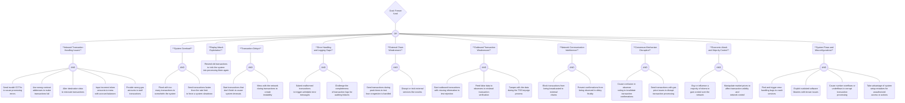

```mermaid
flowchart TD
  A0{Goal: Freeze\nfund}:::objective
    A0---B1(((OR))):::booleanOr
      B1---C1(**Inbound Transaction\nHandling Issues**):::condition
        C1---D1(((AND))):::booleanAnd
          D1---E1(Send invalid CCTXs\nto cause processing\nerrors):::condition
          D1---E2(Use wrong contract\naddresses to make\ntransactions fail):::condition
          D1---E3(Alter destination data\nto misroute transactions):::condition
          D1---E4(Input incorrect token\namounts to mess\nwith account balances):::condition
          D1---E5(Provide wrong gas\namounts to stall\ntransactions):::condition
      B1---C2(**System Overload**):::condition
        C2---D2(((AND))):::booleanAnd
          D2---E6(Flood with too\nmany transactions to\noverwhelm the system):::condition
          D2---E7(Send transactions faster\nthan the rate limit\nto force a system slowdown):::condition
      B1---C3(**Replay Attack\nExploitation**):::condition
        C3---D3(Resend old transactions\nto trick the system\ninto processing them again):::condition
      B1---C4(**Transaction Delays**):::condition
        C4---D4(((AND))):::booleanAnd
          D4---E8(Start transactions that\ndon't finish to cause\nsystem timeouts):::condition
          D4---E9(Mess with the network\nduring transactions to create\ninstability):::condition
      B1---C5(**Error Handling\nand Logging Gaps**):::condition
        C5---D5(((AND))):::booleanAnd
          D5---E10(Submit malformed transactions\nto trigger unhelpful error\nmessages):::condition
          D5---E11(Challenge the completeness\nof transaction logs for\nauditing failures):::condition
      B1---C6(**External Chain\nWeaknesses**):::condition
        C6---D6(((AND))):::booleanAnd
          D6---E12(Send transactions during\npeak times to test\nhow congestion is handled):::condition
          D6---E13(Disrupt or trick external\nservices like oracles):::condition
      B1---C7(**Outbound Transaction\nWeaknesses**):::condition
        C7---D7(((AND))):::booleanAnd
          D7---E14(Start outbound transactions\nwith missing information to\ntest rejection):::condition
          D7---E15(Feed false data to\nobservers to mislead transaction\nverification):::condition
          D7---E16(Tamper with the data\nduring the TSS keysign\nprocess):::condition
      B1---C8(**Network Communication\nInterference**):::condition
        C8---D8(((AND))):::booleanAnd
          D8---E17(Block transactions from\nbeing broadcasted to external\nchains):::condition
          D8---E18(Prevent confirmations from\nbeing observed to delay\nfinality):::condition
      B1---C9(**Consensus Mechanism\nDisruption**):::condition
        C9---D9(((AND))):::booleanAnd
          D9---E19(Cause confusion in observer\nvoting to invalidate transaction\nconfirmations):::condition
          D9---E20(Send transactions with gas\nprice issues to disrupt\ntransaction processing):::condition
      B1---C10(**Economic Attack\nand Majority Control**):::condition
        C10---D10(((AND))):::booleanAnd
          D10---E21(Buy or influence a\nmajority of tokens to\ngain control over the network):::condition
          D10---E22(Manipulate market prices to\naffect transaction validity and\nnetwork control):::condition
      B1---C11(**System Flaws and\nMisconfigurations**):::condition
        C11---D11(((AND))):::booleanAnd
          D11---E23(Find and trigger error\nhandling bugs to crash\nservices):::condition
          D11---E24(Exploit outdated software\nlibraries with known issues):::condition
          D11---E25(Cause number overflows or\nunderflows to corrupt transaction\nprocessing):::condition
          D11---E26(Take advantage of system\nsetup mistakes for unauthorized\naccess or actions):::condition
```