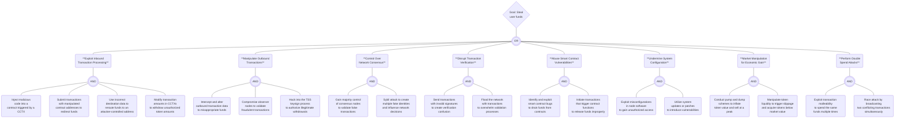

```mermaid
flowchart TD
  A0{Goal: Steal\nuser funds}:::objective
    A0---B1(((OR))):::booleanOr
      B1---C1(**Exploit Inbound\nTransaction Processing**):::condition
        C1---D1(((AND))):::booleanAnd
          D1---E1(Inject malicious\ncode into a\ncontract triggered by a CCTX):::condition
          D1---E2(Submit transactions\nwith manipulated\ncontract addresses to redirect funds):::condition
          D1---E3(Use incorrect\ndestination data to\nreroute funds to an attacker-controlled address):::condition
          D1---E4(Modify transaction\namounts in CCTXs\nto withdraw unauthorized token amounts):::condition
      B1---C2(**Manipulate Outbound\nTransactions**):::condition
        C2---D2(((AND))):::booleanAnd
          D2---E5(Intercept and alter\noutbound transaction data\nto misappropriate funds):::condition
          D2---E6(Compromise observer\nnodes to validate\nfraudulent transactions):::condition
          D2---E7(Hack into the TSS\nkeysign process\nto authorize illegitimate withdrawals):::condition
      B1---C3(**Control Over\nNetwork Consensus**):::condition
        C3---D3(((AND))):::booleanAnd
          D3---E8(Gain majority control\nof consensus nodes\nto validate false transactions):::condition
          D3---E9(Sybil attack to create\nmultiple fake identities\nand influence network decisions):::condition
      B1---C4(**Disrupt Transaction\nVerification**):::condition
        C4---D4(((AND))):::booleanAnd
          D4---E10(Send transactions\nwith invalid signatures\nto create verification confusion):::condition
          D4---E11(Flood the network\nwith transactions\nto overwhelm validation processes):::condition
      B1---C5(**Abuse Smart Contract\nVulnerabilities**):::condition
        C5---D5(((AND))):::booleanAnd
          D5---E12(Identify and exploit\nsmart contract bugs\nto drain funds from contracts):::condition
          D5---E13(Initiate transactions\nthat trigger contract functions\nto release funds improperly):::condition
      B1---C6(**Undermine System\nConfiguration**):::condition
        C6---D6(((AND))):::booleanAnd
          D6---E14(Exploit misconfigurations\nin node software\nto gain unauthorized access):::condition
          D6---E15(Utilize system\nupdates or patches\nto introduce vulnerabilities):::condition
      B1---C7(**Market Manipulation\nfor Economic Gain**):::condition
        C7---D7(((AND))):::booleanAnd
          D7---E16(Conduct pump and dump\nschemes to inflate\ntoken value and sell at a peak):::condition
          D7---E17(Manipulate token\nliquidity to trigger slippage\nand acquire tokens below market value):::condition
      B1---C8(**Perform Double\nSpend Attacks**):::condition
        C8---D8(((AND))):::booleanAnd
          D8---E18(Exploit transaction malleability\nto spend the same\nfunds multiple times):::condition
          D8---E19(Race attack by broadcasting\ntwo conflicting transactions\nsimultaneously):::condition
```