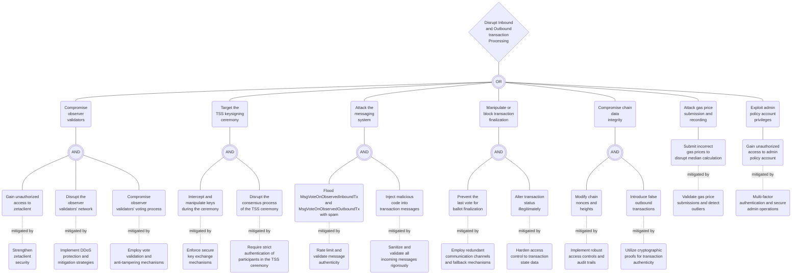

### Crosschain Module Attack Tree 

#### Attacker Goal: Disrupt Inbound and Outbound Transaction Processing

#### Compromise Observer Validators
- **Unauthorized Access to zetaclient**
  - Attempt: Brute force or exploit vulnerabilities.
  - Mitigation: Strengthen zetaclient security with enhanced authentication and encryption.

- **Disrupt Observer Validators' Network**
  - Attempt: Perform a DDoS attack.
  - Mitigation: Implement DDoS protection and mitigation strategies.

- **Compromise Voting Process**
  - Attempt: Inject false votes or prevent vote submission.
  - Mitigation: Employ vote validation and anti-tampering mechanisms.

#### Target the TSS Key Signing Ceremony
- **Intercept and Manipulate Keys**
  - Attempt: Exploit insecure key exchange protocols.
  - Mitigation: Enforce secure key exchange mechanisms.

- **Disrupt TSS Consensus**
  - Attempt: Introduce fake observer validators.
  - Mitigation: Require strict authentication of participants in the TSS ceremony.

#### Attack the Messaging System
- **Flood with Spam**
  - Attempt: Overwhelm with high volumes of fake votes.
  - Mitigation: Rate limit and validate message authenticity.

- **Inject Malicious Code**
  - Attempt: Exploit vulnerabilities in message parsing.
  - Mitigation: Sanitize and validate all incoming messages rigorously.

#### Manipulate or Block Transaction Finalization
- **Prevent Last Vote**
  - Attempt: Attack communication channels for the last vote.
  - Mitigation: Employ redundant communication channels and fallback mechanisms.

- **Alter Transaction Status**
  - Attempt: Gain control over transaction state storage.
  - Mitigation: Harden access control to transaction state data.

#### Compromise Chain Data Integrity
- **Modify Chain Nonces and Heights**
  - Attempt: Gain write access to chain data storage.
  - Mitigation: Implement robust access controls and audit trails.

- **Introduce False Outbound Transactions**
  - Attempt: Spoof transaction messages or IDs.
  - Mitigation: Utilize cryptographic proofs for transaction authenticity.

#### Attack Gas Price Submission and Recording
- **Submit Incorrect Gas Prices**
  - Attempt: Compromise the submission process.
  - Mitigation: Validate submissions and detect outliers.

#### Exploit Admin Policy Account Privileges
- **Unauthorized Access to Admin Account**
  - Attempt: Phishing or exploit admin interfaces.
  - Mitigation: Multi-factor authentication and secure admin operations.
