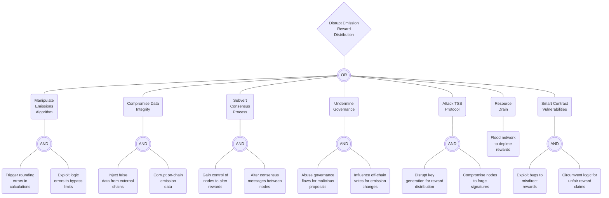

### Emission Module Attack Tree

#### Attacker Goal: Disrupt Emission Reward Distribution

#### Manipulate Emissions Algorithm
- **Trigger Rounding Errors**
  - Exploit the arithmetic of the rewards algorithm to create rounding errors that benefit attackers.
  
- **Exploit Logic Errors**
  - Take advantage of logic flaws in the emissions algorithm to bypass set limits for personal gain.

#### Compromise Data Integrity
- **Inject False Data from External Chains**
  - Insert incorrect or fraudulent data from other blockchains to corrupt the emission calculations.
  
- **Corrupt On-Chain Emission Data**
  - Directly manipulate on-chain data related to emissions to distort reward distributions.

#### Subvert Consensus Process
- **Gain Control of Nodes**
  - Achieve unauthorized control over nodes to influence the reward determination process.
  
- **Alter Consensus Messages**
  - Intercept and modify the messages exchanged between nodes during the consensus to skew emission rewards.

#### Undermine Governance
- **Exploit Governance Flaws**
  - Abuse any existing weaknesses in the governance system to pass malicious proposals affecting emissions.
  
- **Influence Off-Chain Votes**
  - Manipulate the off-chain voting process to bring about changes in emission policies that favor attackers.

#### Attack Threshold Signature Scheme (TSS) Protocol
- **Disrupt Key Generation**
  - Cause interruptions or errors in the key generation phase of the TSS protocol, affecting reward distribution.
  
- **Compromise Nodes for Forged Signatures**
  - Take over nodes in the TSS to create fraudulent signatures, redirecting rewards to attackers.

#### Resource Drain
- **Network Flooding**
  - Overload the network with unnecessary traffic, aiming to deplete the rewards pool.

#### Exploit Smart Contract Vulnerabilities
- **Misdirect Rewards Through Bugs**
  - Identify and leverage bugs within smart contracts to reroute emissions to unintended recipients.
  
- **Circumvent Logic for Unfair Claims**
  - Bypass contract logic through exploitation to claim rewards that are not rightfully due.
