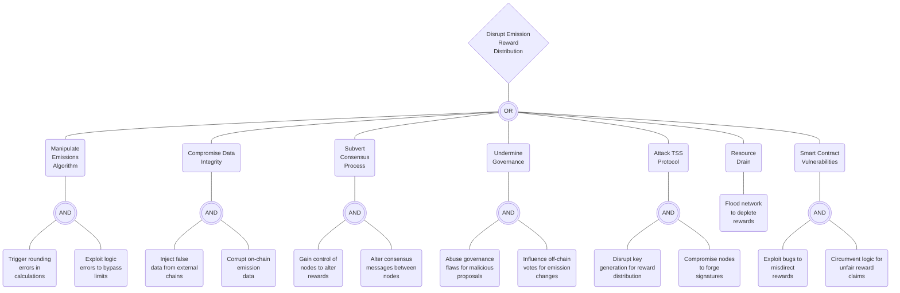

```mermaid
flowchart TD
  A0{Disrupt Emission\nReward\nDistribution}:::objective
    A0---B1(((OR))):::booleanOr
      B1---C1(Manipulate\nEmissions\nAlgorithm):::condition
        C1---D1(((AND))):::booleanAnd
          D1---E1(Trigger rounding\nerrors in\ncalculations):::condition
          D1---E2(Exploit logic\nerrors to bypass\nlimits):::condition
      B1---C2(Compromise Data\nIntegrity):::condition
        C2---D2(((AND))):::booleanAnd
          D2---E3(Inject false\ndata from external\nchains):::condition
          D2---E4(Corrupt on-chain\nemission\ndata):::condition
      B1---C3(Subvert\nConsensus\nProcess):::condition
        C3---D3(((AND))):::booleanAnd
          D3---E5(Gain control of\nnodes to alter\nrewards):::condition
          D3---E6(Alter consensus\nmessages between\nnodes):::condition
      B1---C4(Undermine\nGovernance):::condition
        C4---D4(((AND))):::booleanAnd
          D4---E7(Abuse governance\nflaws for malicious\nproposals):::condition
          D4---E8(Influence off-chain\nvotes for emission\nchanges):::condition
      B1---C5(Attack TSS\nProtocol):::condition
        C5---D5(((AND))):::booleanAnd
          D5---E9(Disrupt key\ngeneration for reward\ndistribution):::condition
          D5---E10(Compromise nodes\nto forge\nsignatures):::condition
      B1---C6(Resource\nDrain):::condition
        C6---D6(Flood network\nto deplete\nrewards):::condition
      B1---C7(Smart Contract\nVulnerabilities):::condition
        C7---D7(((AND))):::booleanAnd
          D7---E11(Exploit bugs to\nmisdirect\nrewards):::condition
          D7---E12(Circumvent logic for\nunfair reward\nclaims):::condition
```