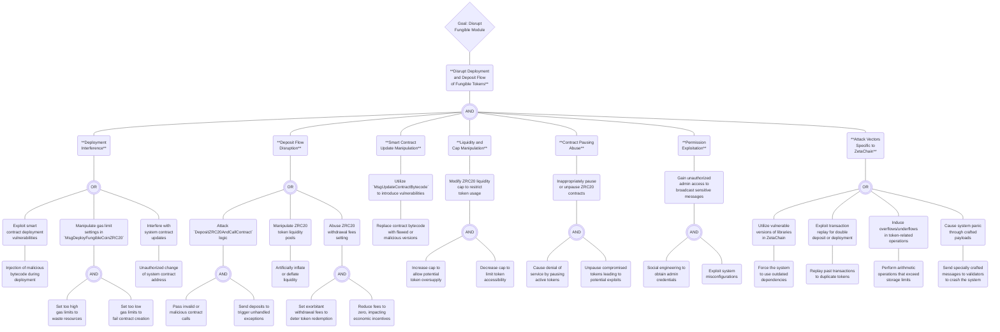

```mermaid
flowchart TD
  A0{Goal: Disrupt\nFungible Module}:::objective
    A0---B1(**Disrupt Deployment\nand Deposit Flow\nof Fungible Tokens**):::condition
      B1---C1(((AND))):::booleanAnd
        C1---D1(**Deployment\nInterference**):::condition
          D1---E1(((OR))):::booleanOr
            E1---F1(Exploit smart\ncontract deployment\nvulnerabilities):::condition
              F1---G1(Injection of malicious\nbytecode during\ndeployment):::condition
            E1---F2(Manipulate gas limit\nsettings in\n`MsgDeployFungibleCoinZRC20` ):::condition
              F2---G2(((AND))):::booleanAnd
                G2---H1(Set too high\ngas limits to\nwaste resources):::condition
                G2---H2(Set too low\ngas limits to\nfail contract creation):::condition
            E1---F3(Interfere with\nsystem contract\nupdates):::condition
              F3---G3(Unauthorized change\nof system contract\naddress):::condition
        C1---D2(**Deposit Flow\nDisruption**):::condition
          D2---E2(((OR))):::booleanOr
            E2---F4(Attack `DepositZRC20AndCallContract`\nlogic):::condition
              F4---G4(((AND))):::booleanAnd
                G4---H3(Pass invalid or\nmalicious contract\ncalls):::condition
                G4---H4(Send deposits to\ntrigger unhandled\nexceptions):::condition
            E2---F5(Manipulate ZRC20\ntoken liquidity\npools):::condition
              F5---G5(Artificially inflate\nor deflate\nliquidity):::condition
            E2---F6(Abuse ZRC20\nwithdrawal fees\nsetting):::condition
              F6---G6(((AND))):::booleanAnd
                G6---H5(Set exorbitant\nwithdrawal fees to\ndeter token redemption):::condition
                G6---H6(Reduce fees to\nzero, impacting\neconomic incentives):::condition
        C1---D3(**Smart Contract\nUpdate Manipulation**):::condition
          D3---E3(Utilize `MsgUpdateContractBytecode`\nto introduce vulnerabilities):::condition
            E3---F7(Replace contract bytecode\nwith flawed or\nmalicious versions):::condition
        C1---D4(**Liquidity and\nCap Manipulation**):::condition
          D4---E4(Modify ZRC20 liquidity\ncap to restrict\ntoken usage):::condition
            E4---F8(((AND))):::booleanAnd
              F8---G7(Increase cap to\nallow potential\ntoken oversupply):::condition
              F8---G8(Decrease cap to\nlimit token\naccessibility):::condition
        C1---D5(**Contract Pausing\nAbuse**):::condition
          D5---E5(Inappropriately pause\nor unpause ZRC20\ncontracts):::condition
            E5---F9(((AND))):::booleanAnd
              F9---G9(Cause denial of\nservice by pausing\nactive tokens):::condition
              F9---G10(Unpause compromised\ntokens leading to\npotential exploits):::condition
        C1---D6(**Permission\nExploitation**):::condition
          D6---E6(Gain unauthorized\nadmin access to\nbroadcast sensitive messages):::condition
            E6---F10(((AND))):::booleanAnd
              F10---G11(Social engineering to\nobtain admin\ncredentials):::condition
              F10---G12(Exploit system\nmisconfigurations):::condition
        C1---D7(**Attack Vectors\nSpecific to\nZetaChain**):::condition
          D7---E7(((OR))):::booleanOr
            E7---F11(Utilize vulnerable\nversions of libraries\nin ZetaChain):::condition
              F11---G13(Force the system\nto use outdated\ndependencies):::condition
            E7---F12(Exploit transaction\nreplay for double\ndeposit or deployment):::condition
              F12---G14(Replay past transactions\nto duplicate tokens):::condition
            E7---F13(Induce overflows/underflows\nin token-related\noperations):::condition
              F13---G15(Perform arithmetic\noperations that exceed\nstorage limits):::condition
            E7---F14(Cause system panic\nthrough crafted\npayloads):::condition
              F14---G16(Send specially crafted\nmessages to validators\nto crash the system):::condition
```