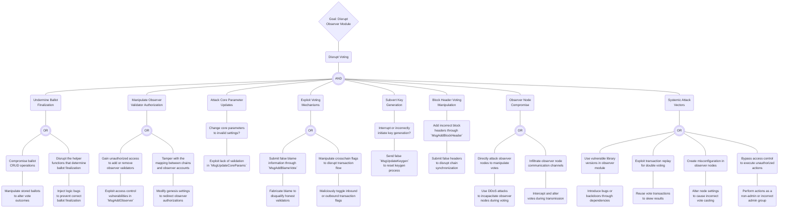

```mermaid
flowchart TD
  A0{Goal: Disrupt\nObserver Module}:::objective
    A0---B1(Disrupt Voting):::condition
      B1---C1(((AND))):::booleanAnd
        C1---D1(Undermine Ballot\nFinalization):::condition
          D1---E1(((OR))):::booleanOr
            E1---F1(Compromise ballot\nCRUD operations):::condition
              F1---G1(Manipulate stored ballots\nto alter vote\noutcomes):::condition
            E1---F2(Disrupt the helper\nfunctions that determine\nballot finalization):::condition
              F2---G2(Inject logic bugs\nto prevent correct\nballot finalization):::condition
        C1---D2(Manipulate Observer\nValidator Authorization):::condition
          D2---E2(((OR))):::booleanOr
            E2---F3(Gain unauthorized access\nto add or remove\nobserver validators):::condition
              F3---G3(Exploit access control\nvulnerabilities in `MsgAddObserver`):::condition
            E2---F4(Tamper with the\nmapping between chains\nand observer accounts):::condition
              F4---G4(Modify genesis settings\nto redirect observer\nauthorizations):::condition
        C1---D3(Attack Core Parameter\nUpdates):::condition
          D3---E3(Change core parameters\nto invalid settings?):::condition
            E3---F5(Exploit lack of validation\nin `MsgUpdateCoreParams`):::condition
        C1---D4(Exploit Voting\nMechanisms):::condition
          D4---E4(((OR))):::booleanOr
            E4---F6(Submit false blame\ninformation through `MsgAddBlameVote`):::condition
              F6---G5(Fabricate blame to\ndisqualify honest\nvalidators):::condition
            E4---F7(Manipulate crosschain flags\nto disrupt transaction\nflow):::condition
              F7---G6(Maliciously toggle inbound\nor outbound transaction\nflags):::condition
        C1---D5(Subvert Key\nGeneration):::condition
          D5---E5(Interrupt or incorrectly\ninitiate key generation?):::condition
            E5---F8(Send false `MsgUpdateKeygen`\nto reset keygen\nprocess):::condition
        C1---D6(Block Header Voting\nManipulation):::condition
          D6---E6(Add incorrect block\nheaders through `MsgAddBlockHeader`):::condition
            E6---F9(Submit false headers\nto disrupt chain\nsynchronization):::condition
        C1---D7(Observer Node\nCompromise):::condition
          D7---E7(((OR))):::booleanOr
            E7---F10(Directly attack observer\nnodes to manipulate\nvotes):::condition
              F10---G7(Use DDoS attacks\nto incapacitate observer\nnodes during voting):::condition
            E7---F11(Infiltrate observer node\ncommunication channels):::condition
              F11---G8(Intercept and alter\nvotes during transmission):::condition
        C1---D8(Systemic Attack\nVectors):::condition
          D8---E8(((OR))):::booleanOr
            E8---F12(Use vulnerable library\nversions in observer\nmodule):::condition
              F12---G9(Introduce bugs or\nbackdoors through dependencies):::condition
            E8---F13(Exploit transaction replay\nfor double voting):::condition
              F13---G10(Reuse vote transactions\nto skew results):::condition
            E8---F14(Create misconfiguration in\nobserver nodes):::condition
              F14---G11(Alter node settings\nto cause incorrect\nvote casting):::condition
            E8---F15(Bypass access control\nto execute unauthorized\nactions):::condition
              F15---G12(Perform actions as a\nnon-admin or incorrect\nadmin group):::condition
```