```mermaid
flowchart TD
  A0{Goal: Disrupt\nObserver Module}:::objective
    A0---B1(Disrupt Voting):::condition
      B1---C1(((AND))):::booleanAnd
        C1---D1(Undermine Ballot\nFinalization):::condition
          D1---E1(((OR))):::booleanOr
            E1---F1(Compromise ballot\nCRUD operations):::condition
              F1---G1(Manipulate stored ballots\nto alter vote\noutcomes):::condition
            E1---F2(Disrupt the helper\nfunctions that determine\nballot finalization):::condition
              F2---G2(Inject logic bugs\nto prevent correct\nballot finalization):::condition
        C1---D2(Manipulate Observer\nValidator Authorization):::condition
          D2---E2(((OR))):::booleanOr
            E2---F3(Gain unauthorized access\nto add or remove\nobserver validators):::condition
              F3---G3(Exploit access control\nvulnerabilities in `MsgAddObserver`):::condition
            E2---F4(Tamper with the\nmapping between chains\nand observer accounts):::condition
              F4---G4(Modify genesis settings\nto redirect observer\nauthorizations):::condition
        C1---D3(Attack Core Parameter\nUpdates):::condition
          D3---E3(Change core parameters\nto invalid settings?):::condition
            E3---F5(Exploit lack of validation\nin `MsgUpdateCoreParams`):::condition
        C1---D4(Exploit Voting\nMechanisms):::condition
          D4---E4(((OR))):::booleanOr
            E4---F6(Submit false blame\ninformation through `MsgAddBlameVote`):::condition
              F6---G5(Fabricate blame to\ndisqualify honest\nvalidators):::condition
            E4---F7(Manipulate crosschain flags\nto disrupt transaction\nflow):::condition
              F7---G6(Maliciously toggle inbound\nor outbound transaction\nflags):::condition
        C1---D5(Subvert Key\nGeneration):::condition
          D5---E5(Interrupt or incorrectly\ninitiate key generation?):::condition
            E5---F8(Send false `MsgUpdateKeygen`\nto reset keygen\nprocess):::condition
        C1---D6(Block Header Voting\nManipulation):::condition
          D6---E6(Add incorrect block\nheaders through `MsgAddBlockHeader`):::condition
            E6---F9(Submit false headers\nto disrupt chain\nsynchronization):::condition
        C1---D7(Observer Node\nCompromise):::condition
          D7---E7(((OR))):::booleanOr
            E7---F10(Directly attack observer\nnodes to manipulate\nvotes):::condition
              F10---G7(Use DDoS attacks\nto incapacitate observer\nnodes during voting):::condition
            E7---F11(Infiltrate observer node\ncommunication channels):::condition
              F11---G8(Intercept and alter\nvotes during transmission):::condition
        C1---D8(Systemic Attack\nVectors):::condition
          D8---E8(((OR))):::booleanOr
            E8---F12(Use vulnerable library\nversions in observer\nmodule):::condition
              F12---G9(Introduce bugs or\nbackdoors through dependencies):::condition
            E8---F13(Exploit transaction replay\nfor double voting):::condition
              F13---G10(Reuse vote transactions\nto skew results):::condition
            E8---F14(Create misconfiguration in\nobserver nodes):::condition
              F14---G11(Alter node settings\nto cause incorrect\nvote casting):::condition
            E8---F15(Bypass access control\nto execute unauthorized\nactions):::condition
              F15---G12(Perform actions as a\nnon-admin or incorrect\nadmin group):::condition
```

## Observer Module Attack Tree 

## Attacker Goal: Disrupt Voting

#### Undermine Ballot Finalization
- **Compromise ballot CRUD operations**
  - Manipulate stored ballots to alter vote outcomes.
    - `> Implement cryptographic audit trails for ballot changes [ ]`
    - `> Conduct periodic integrity checks on ballot storage [x]`
- **Disrupt the helper functions that determine ballot finalization**
  - Inject logic bugs to prevent correct ballot finalization.
    - `> Use formal verification for critical voting functions [ ]`
    - `> Set up automated testing for all voting pathways [x]`

### Manipulate Observer Validator Authorization
- **Gain unauthorized access to add or remove observer validators**
  - Exploit access control vulnerabilities in `MsgAddObserver`.
    - `> Enforce strict access control policies and permissions [ ]`
    - `> Utilize multi-factor authentication for admin actions [x]`
- **Tamper with the mapping between chains and observer accounts**
  - Modify genesis settings to redirect observer authorizations.
    - `> Lock down genesis configuration changes [ ]`
    - `> Use transparent and auditable genesis change proposals [x]`

### Attack Core Parameter Updates
- **Change core parameters to invalid settings**
  - Exploit lack of validation in `MsgUpdateCoreParams`.
    - `> Implement comprehensive parameter validation checks [ ]`
    - `> Require consensus for any parameter change [x]`

### Exploit Voting Mechanisms
- **Submit false blame information through `MsgAddBlameVote`**
  - Fabricate blame to disqualify honest validators.
    - `> Require proof of misbehavior for blame acceptance [ ]`
    - `> Set up a dispute resolution mechanism for blame votes [ ]`
- **Manipulate crosschain flags to disrupt transaction flow**
  - Maliciously toggle inbound or outbound transaction flags.
    - `> Apply change delays and notifications for flag updates [ ]`
    - `> Multi-signature requirements for critical flag changes [x]`

### Subvert Key Generation
- **Interrupt or incorrectly initiate key generation**
  - Send false `MsgUpdateKeygen` to reset keygen process.
    - `> Rate limit keygen updates to prevent spam [ ]`
    - `> Verify the necessity of keygen before processing [x]`

### Block Header Voting Manipulation
- **Add incorrect block headers through `MsgAddBlockHeader`**
  - Submit false headers to disrupt chain synchronization.
    - `> Employ consensus verification for new block headers [ ]`
    - `> Use multiple independent observer validators for header verification [x]`

### Observer Node Compromise
- **Directly attack observer nodes to manipulate votes**
  - Use DDoS attacks to incapacitate observer nodes during voting.
    - `> Distribute observer nodes geographically for resilience [ ]`
    - `> Implement DDoS protection and anomaly detection systems [x]`
- **Infiltrate observer node communication channels**
  - Intercept and alter votes during transmission.
    - `> Encrypt inter-validator communication [x]`
    - `> Use secure, authenticated channels for node communication [ ]`

### Systemic Attack Vectors
- **Use vulnerable library versions in observer module**
  - Introduce bugs or backdoors through dependencies.
    - `> Automate dependency updates with security review processes [ ]`
    - `> Monitor third-party libraries for known vulnerabilities [x]`
- **Exploit transaction replay for double voting**
  - Reuse vote transactions to skew results.
    - `> Implement unique transaction identifiers [x]`
    - `> Enforce transaction finality and nonce checks [ ]`
- **Create misconfiguration in observer nodes**
  - Alter node settings to cause incorrect vote casting.
    - `> Standardize configuration deployment with audit trails [ ]`
    - `> Regularly review and test node configurations [x]`
- **Bypass access control to execute unauthorized actions**
  - Perform actions as a non-admin or incorrect admin group.
    - `> Enforce role-based access control with strict verification [x]`
    - `> Regularly audit admin groups and access logs [ ]`
