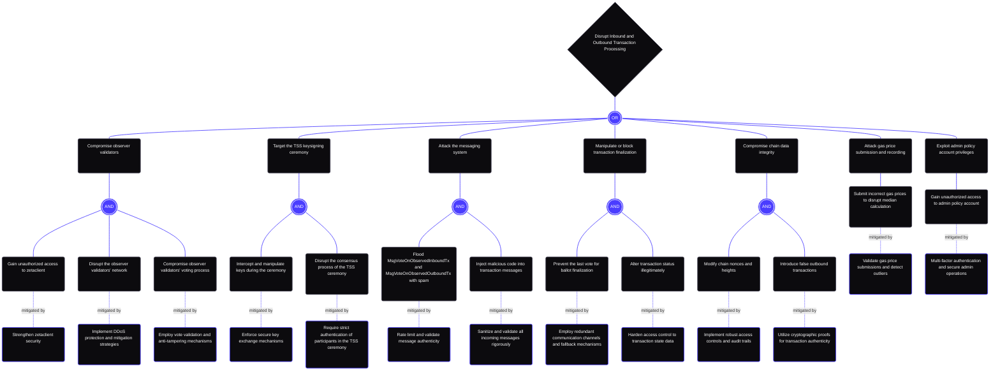

cross chain module attack tree

```mermaid
flowchart TD
  A0{Disrupt Inbound and Outbound Transaction Processing\n\n\n}:::objective
    A0---B1(((OR))):::booleanOr
      B1---C1(Compromise observer validators\n\n\n):::condition
        C1---D1(((AND))):::booleanAnd
          D1---E1(Gain unauthorized access to zetaclient\n\n\n):::condition
            E1-. mitigated by .-F1(Strengthen zetaclient security\n\n\n):::condition
          D1---E2(Disrupt the observer validators' network\n\n\n):::condition
            E2-. mitigated by .-F2(Implement DDoS protection and mitigation strategies\n\n\n):::condition
          D1---E3(Compromise observer validators' voting process\n\n\n):::condition
            E3-. mitigated by .-F3(Employ vote validation and anti-tampering mechanisms\n\n\n):::condition
      B1---C2(Target the TSS keysigning ceremony\n\n\n):::condition
        C2---D2(((AND))):::booleanAnd
          D2---E4(Intercept and manipulate keys during the ceremony\n\n\n):::condition
            E4-. mitigated by .-F4(Enforce secure key exchange mechanisms\n\n\n):::condition
          D2---E5(Disrupt the consensus process of the TSS ceremony\n\n\n):::condition
            E5-. mitigated by .-F5(Require strict authentication of participants in the TSS ceremony\n\n\n):::condition
      B1---C3(Attack the messaging system\n\n\n):::condition
        C3---D3(((AND))):::booleanAnd
          D3---E6(Flood MsgVoteOnObservedInboundTx and MsgVoteOnObservedOutboundTx with spam\n\n\n):::condition
            E6-. mitigated by .-F6(Rate limit and validate message authenticity\n\n\n):::condition
          D3---E7(Inject malicious code into transaction messages\n\n\n):::condition
            E7-. mitigated by .-F7(Sanitize and validate all incoming messages rigorously\n\n\n):::condition
      B1---C4(Manipulate or block transaction finalization\n\n\n):::condition
        C4---D4(((AND))):::booleanAnd
          D4---E8(Prevent the last vote for ballot finalization\n\n\n):::condition
            E8-. mitigated by .-F8(Employ redundant communication channels and fallback mechanisms\n\n\n):::condition
          D4---E9(Alter transaction status illegitimately\n\n\n):::condition
            E9-. mitigated by .-F9(Harden access control to transaction state data\n\n\n):::condition
      B1---C5(Compromise chain data integrity\n\n\n):::condition
        C5---D5(((AND))):::booleanAnd
          D5---E10(Modify chain nonces and heights\n\n\n):::condition
            E10-. mitigated by .-F10(Implement robust access controls and audit trails\n\n\n):::condition
          D5---E11(Introduce false outbound transactions\n\n\n):::condition
            E11-. mitigated by .-F11(Utilize cryptographic proofs for transaction authenticity\n\n\n):::condition
      B1---C6(Attack gas price submission and recording\n\n\n):::condition
        C6---D6(Submit incorrect gas prices to disrupt median calculation\n\n\n):::condition
          D6-. mitigated by .-E12(Validate gas price submissions and detect outliers\n\n\n):::condition
      B1---C7(Exploit admin policy account privileges\n\n\n):::condition
        C7---D7(Gain unauthorized access to admin policy account\n\n\n):::condition
          D7-. mitigated by .-E13(Multi-factor authentication and secure admin operations\n\n\n):::condition
  classDef objective fill:#0c0b0e,color:#ffffff,stroke:#3e3b4e,stroke-width:2px
  classDef condition fill:#0c0b0e,color:#ffffff,stroke:#3e3b4e,stroke-width:2px
  classDef assumption fill:#0c0b0e,color:#ffffff,stroke:#3e3b4e,stroke-width:2px
  classDef booleanAnd fill:#4a3dff,color:#ffffff,stroke:#ffffff,stroke-width:2px
  classDef booleanOr fill:#4a3dff,color:#ffffff,stroke:#ffffff,stroke-width:2px
  style F1 stroke:#4a3dff,stroke-width:2px
  style F2 stroke:#4a3dff,stroke-width:2px
  style F3 stroke:#4a3dff,stroke-width:2px
  style F4 stroke:#4a3dff,stroke-width:2px
  style F5 stroke:#4a3dff,stroke-width:2px
  style F6 stroke:#4a3dff,stroke-width:2px
  style F7 stroke:#4a3dff,stroke-width:2px
  style F8 stroke:#4a3dff,stroke-width:2px
  style F9 stroke:#4a3dff,stroke-width:2px
  style F10 stroke:#4a3dff,stroke-width:2px
  style F11 stroke:#4a3dff,stroke-width:2px
  style E12 stroke:#4a3dff,stroke-width:2px
  style E13 stroke:#4a3dff,stroke-width:2px
  linkStyle 0,1,2,3,4,5,6,7,8,9,10,11,12,13,14,15,16,17,18,19,20,21,22,23,24,25,26,27,28,29,30,31,32,33,34,35,36,37,38 stroke:#4a3dff,stroke-width:2px

```